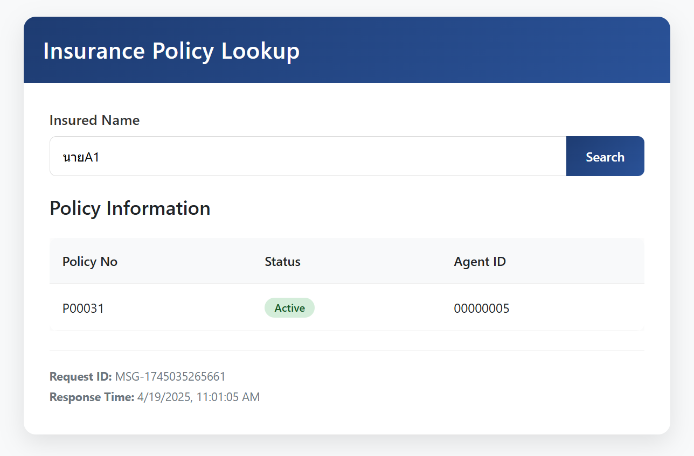

# Insurance Policy Web Service - React & Spring Boot Integration

This project consists of a Spring Boot backend that provides policy information via a REST API and an React frontend that allows users to search for policies by insured name.

## Project Structure

### Backend (Spring Boot)
- Java models that match the request/response structure
- REST controller for handling API requests
- Service layer for business logic

### Frontend (React)
- Components for policy search and displaying results
- Service for API communication

### Backend Setup
   ```
   testdev-webservice\springboot-backend\src\main\java\com\example\testdev
   ├── TestdevApplication.java
   ├── controller/
   │   └── PolicyController.java
   ├── model/
   │   ├── HeaderDataRequest.java
   │   ├── HeaderDataResponse.java
   │   ├── Policy.java
   │   ├── PolicyResponse.java
   │   ├── PolicyRequest.java
   │   ├── RequestRecord.java
   │   ├── ResponseRecord.java
   │   └── ResponseStatus.java
   └── service/
       └── PolicyService.java
   ```

**Configure application.properties**:
   ```properties
   server.port=8080
   ```

**Build and run the Spring Boot application**:
   ```bash
   ./mvnw spring-boot:run
   ```

### Frontend Setup
   ```
   testdev-webservice\react-frontend\src
   ├── App.css
   ├── App.js
   ├── index.css
   ├── index.js
   ├── components/
   │   ├── PolicyComponent.css
   │   └── PolicyComponent.jsx
   └── services/
       └── PolicyService.js
   ```

## Testing

1. Access the React application at `http://localhost:3000`
2. Enter "นายA1" as the insured name to see a successful policy response
3. Enter any other name to see an error response



## API Documentation

### Retrieve Policy Information

**Endpoint**: POST /api/policy/retrieve

**Request Body**:
```json
{
  "headerData": {
    "messageId": "123",
    "sendDateTime": "2011-12-30 23:59:59"
  },
  "requestRecord": {
    "insureName": "นายA1"
  }
}
```

**Response Body**:
```json
{
    "headerData": {
        "messageId": "123",
        "sendDateTime": "2011-12-30 23:59:59",
        "responseDateTime": "2025-04-19 11:35:33"
    },
    "responseRecord": {
        "policy": [
            {
                "policyNo": "P00031",
                "status": "A",
                "agenID": "00000005"
            }
        ],
        "policyNo": "P00031",
        "policyType": "CL",
        "status": "A",
        "agenID": "00000005"
    },
    "responseStatus": {
        "status": "S",
        "errorCode": "",
        "errorMessage": ""
    }
}
```
